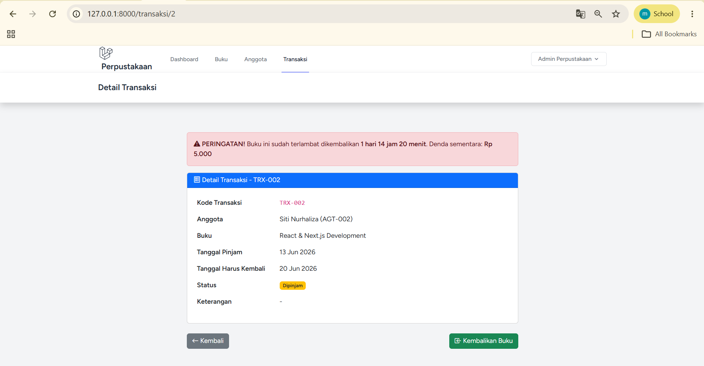
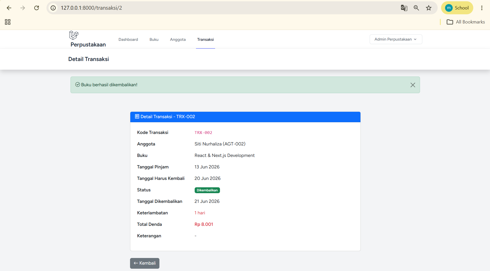
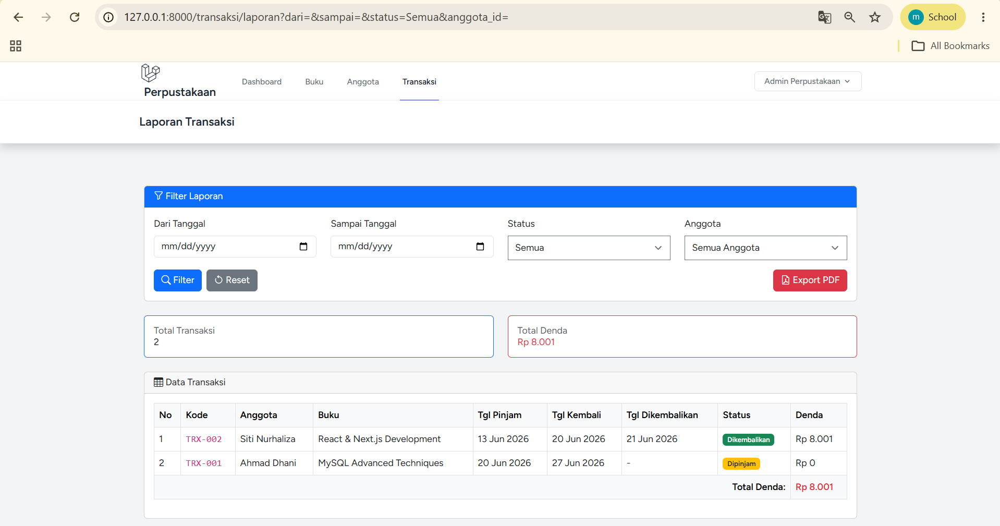
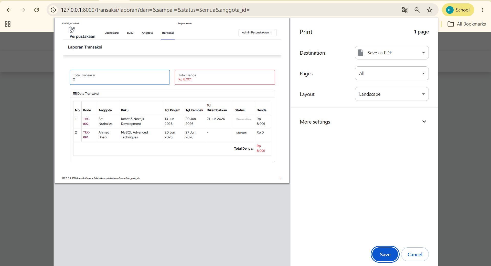
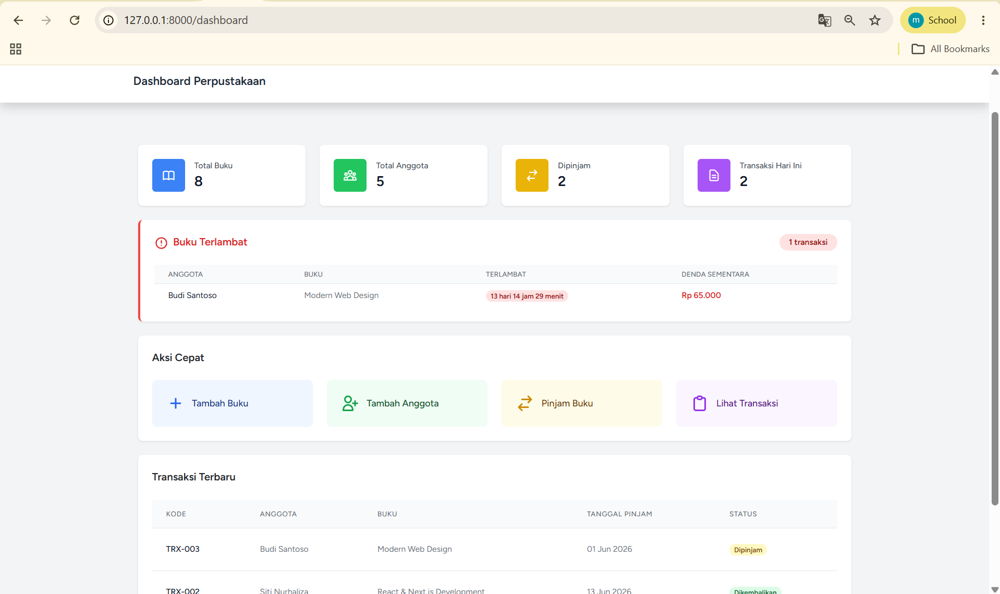
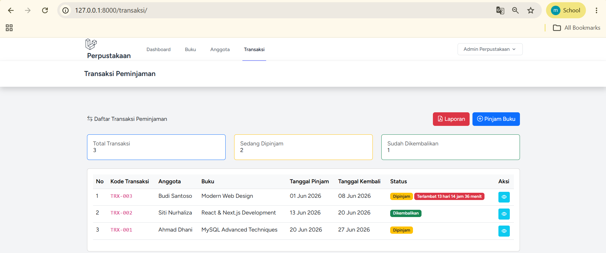

# Tugas Pemrograman Web Pertemuan 14

## Identitas
- Nama: Naufal Setyabagas Alifian
- NIM: 60324033
- Kelas: B
- Mata Kuliah: Pemrograman Web 2

---

# Tugas yang dibuat

## Tugas 1 - Fitur Pengembalian Buku (40%)
- Halaman detail transaksi dilengkapi dengan tombol **"Kembalikan Buku"**.
- Implementasi method `kembalikan()` di controller menggunakan database transaction.
- **Perhitungan Denda Otomatis**: Dihitung sebesar Rp 5.000/hari hanya jika tanggal dikembalikan melewati tanggal harus kembali.
- Menampilkan total denda keterlambatan pada halaman detail.
- **Update Stok Otomatis**: Stok buku otomatis bertambah (+1) saat buku berhasil dikembalikan.

## Tugas 2 - Laporan Transaksi (30%)
- Halaman khusus laporan transaksi pada route `/transaksi/laporan`.
- **Fitur Filter Laporan**:
  - Berdasarkan Range Tanggal (Dari - Sampai).
  - Berdasarkan Status (Semua / Dipinjam / Dikembalikan).
  - Berdasarkan Anggota peminjam (dropdown).
- **Tampilan Informatif**: Tabel rekap transaksi, Total jumlah transaksi, dan Total keseluruhan denda.
- **Export PDF**: Fitur cetak laporan ke PDF menggunakan mekanisme print browser (`window.print()`) yang menyesuaikan tampilan dengan menyembunyikan form filter saat dicetak.

## Tugas 3 - Notifikasi Terlambat (30%)
- **Dashboard Widget**: Tambahan card khusus "Buku Terlambat" di dashboard yang menampilkan jumlah transaksi terlambat, daftar anggota yang terlambat, serta estimasi denda sementaranya.
- **Badge Terlambat**: Pada tabel di index transaksi, ditambahkan badge warna merah "Terlambat X hari" untuk peminjaman yang sudah lewat batas waktu.
- **Warning Reminder**: Pada halaman detail transaksi, muncul alert box peringatan (warning) berwarna merah jika peminjaman saat ini sudah melewati tanggal kembali.

---

# Screenshot Hasil

> Semua screenshot disimpan di folder `image/`

## 1. Detail Transaksi (Tombol Kembalikan)
Menampilkan halaman detail transaksi peminjaman yang sedang berlangsung, dilengkapi tombol "Kembalikan Buku".

---

## 2. Detail Transaksi (Bukti Pengembalian & Denda)
Menampilkan detail transaksi setelah buku dikembalikan, memuat informasi tanggal dikembalikan, lama keterlambatan, dan denda (jika ada).

---

## 3. Halaman Laporan Transaksi & Filter
Menampilkan halaman rekap laporan transaksi dengan form filter (tanggal, status, anggota) beserta total transaksi dan total denda.

---

## 4. Hasil Export PDF Laporan
Menampilkan print preview / hasil Export PDF dari laporan transaksi dengan format yang rapi (tanpa form filter).

---

## 5. Dashboard - Widget Buku Terlambat
Menampilkan halaman dashboard baru yang memiliki widget khusus berisi daftar buku yang terlambat dikembalikan beserta estimasi dendanya.

---

## 6. Index Transaksi - Badge Terlambat
Menampilkan daftar seluruh transaksi dengan penanda badge merah "Terlambat X hari" untuk buku yang belum dikembalikan melewati batas waktu.

---
